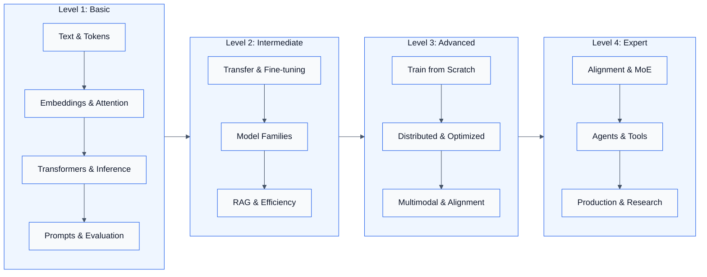
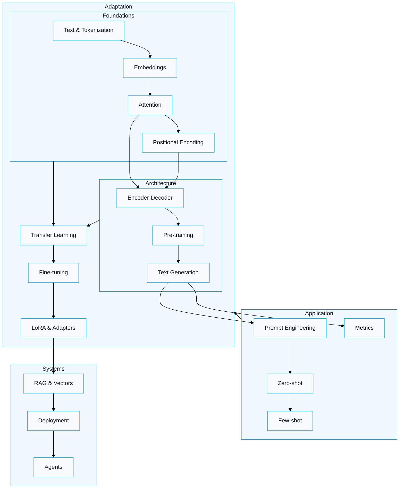
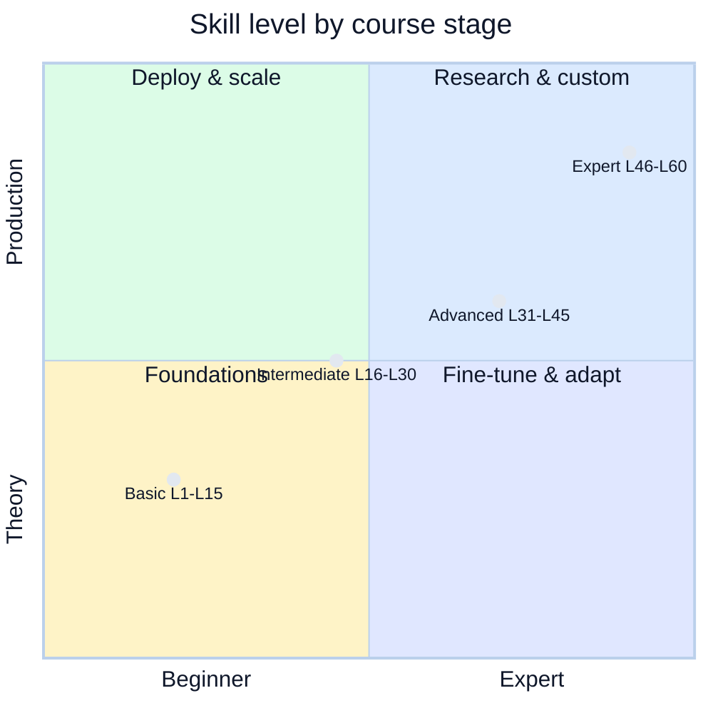
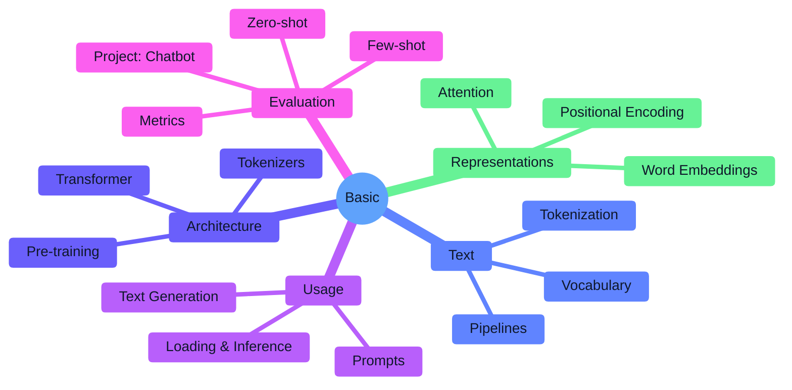
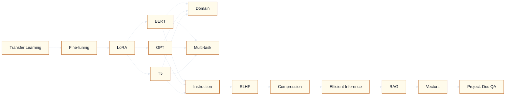
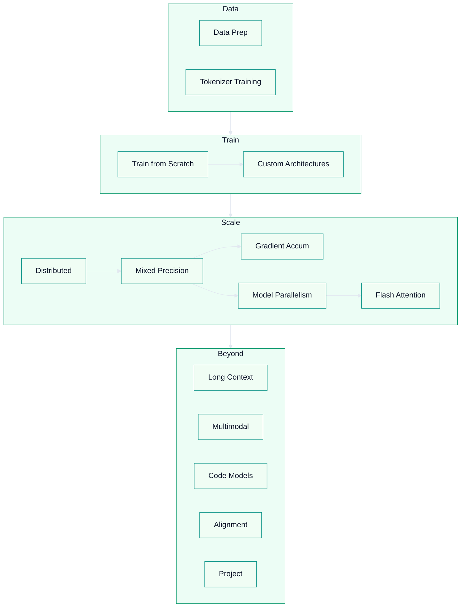
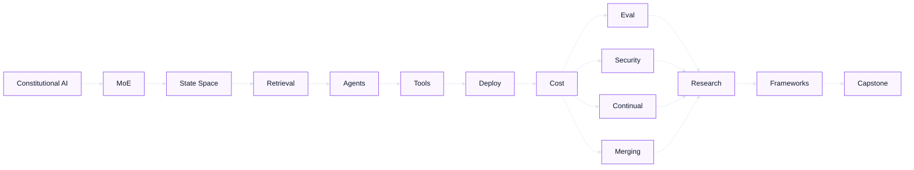

<div align="center">

# LLM Mastery: Zero to Production

### Master Large Language Models through 60 hands-on lessons

**From tokenization to transformers. From fine-tuning to deployment. Build real AI that works.**

60 hands-on lessons · 4 progressive levels · Real-world projects

[Quick Start](#-getting-started) · [Learning Flow](#-learning-flow) · [Course Map](#-course-map) · [Contributing](./CONTRIBUTING.md) · [LinkedIn](https://www.linkedin.com/in/karthik-arjun-a5b4a258/)

[](https://www.python.org/)
[](./LICENSE)
[](./01_Basic/)
[](https://nexageapps.com)

---

**If you find this helpful, please star the repository!**

[](https://buymeacoffee.com/fcc4sbsx5f6)

*Made by a student, for students*

</div>

---

## Table of Contents

| Section | Description |
|--------|--------------|
| [Learning Flow](#-learning-flow) | Visual journey from Basic → Expert |
| [Course Map](#-course-map) | Level-by-level breakdown with Mermaid |
| [Getting Started](#-getting-started) | Prerequisites, install, first steps |
| [Repository Structure](#-repository-structure) | Folder layout and navigation |
| [Learning Outcomes](#-learning-outcomes) | What you'll achieve |
| [References & Support](#-references--support) | Resources and contact |

---

## Learning Flow

This course is designed as a **single path**: each level builds on the previous one. Use the diagrams below to see how concepts connect and where to go next.

### Journey: Basic → Expert



### Concept Dependencies (What Leads to What)



### Skill Progression at a Glance



---

## Course Map

### Level 1: Basic (L1–L15) — Foundations

**Goal:** Understand text, tokens, embeddings, attention, and how to use pre-trained transformers.



| # | Topic | One-line description |
|---|--------|----------------------|
| L1 | Text Processing & Tokenization | Text data, tokens, vocabulary |
| L2 | Transformer Pipelines | Pre-trained models, classification, sentiment |
| L3 | Word Embeddings | Word2Vec, GloVe, embedding spaces |
| L4 | Attention Mechanisms | Self-attention, multi-head attention |
| L5 | Positional Encoding | Position in sequences |
| L6 | Transformer Architecture | Encoder-decoder, layer norm |
| L7 | Pre-training Concepts | MLM, CLM, training objectives |
| L8 | Tokenizers Deep Dive | BPE, WordPiece, SentencePiece |
| L9 | Model Loading & Inference | HuggingFace, model selection |
| L10 | Text Generation Basics | Greedy, beam search, sampling |
| L11 | Prompt Engineering 101 | Effective prompts |
| L12 | Zero-shot Learning | Classification without training |
| L13 | Few-shot Learning | Learning from examples |
| L14 | Model Evaluation Metrics | Perplexity, BLEU, ROUGE |
| L15 | **Basic Project** | Simple chatbot |

---

### Level 2: Intermediate (L16–L30) — Adaptation & Systems

**Goal:** Fine-tune models, use major families (BERT/GPT/T5), and build RAG and efficient inference.



| # | Topic | One-line description |
|---|--------|----------------------|
| L16 | Transfer Learning | Adapting pre-trained models |
| L17 | Fine-tuning Techniques | Full vs parameter-efficient |
| L18 | LoRA & Adapters | Low-rank adaptation |
| L19 | BERT Family | BERT, RoBERTa, ALBERT, DistilBERT |
| L20 | GPT Family | GPT-2/3/4 architecture |
| L21 | T5 & Seq2Seq | Text-to-text frameworks |
| L22 | Domain Adaptation | Domain-specific models |
| L23 | Multi-task Learning | Multiple objectives |
| L24 | Instruction Tuning | Following instructions |
| L25 | RLHF Basics | Human feedback |
| L26 | Model Compression | Distillation, pruning, quantization |
| L27 | Efficient Inference | Deployment optimizations |
| L28 | RAG Systems | Retrieval-augmented generation |
| L29 | Vector Databases | Storing/retrieving embeddings |
| L30 | **Intermediate Project** | Document Q&A system |

---

### Level 3: Advanced (L31–L45) — Training & Scale

**Goal:** Train from scratch, use custom architectures, distributed and mixed-precision training, and multimodal/alignment topics.



| # | Topic | One-line description |
|---|--------|----------------------|
| L31 | Training from Scratch | Building LLMs from scratch |
| L32 | Custom Architectures | Novel transformer variants |
| L33 | Distributed Training | Multi-GPU, multi-node |
| L34 | Mixed Precision Training | FP16, BF16 |
| L35 | Gradient Accumulation | Large models, limited memory |
| L36 | Advanced Optimization | AdamW, Lion, LR schedules |
| L37 | Data Preparation | Curating and cleaning data |
| L38 | Tokenizer Training | Custom tokenizers |
| L39 | Model Parallelism | Pipeline and tensor parallelism |
| L40 | Flash Attention | Efficient attention |
| L41 | Long Context Models | Extended sequences |
| L42 | Multimodal LLMs | Vision-language (CLIP, LLaVA) |
| L43 | Code Generation Models | Codex, CodeLlama, StarCoder |
| L44 | Model Alignment | Safety, bias, ethics |
| L45 | **Advanced Project** | Specialized domain model |

---

### Level 4: Expert (L46–L60) — Research & Production

**Goal:** Alignment, MoE/SSMs, agents, tools, deployment, and capstone.



| # | Topic | One-line description |
|---|--------|----------------------|
| L46 | Constitutional AI | Advanced alignment |
| L47 | Mixture of Experts | MoE (Mixtral, GPT-4) |
| L48 | State Space Models | Mamba, alternatives to attention |
| L49 | Retrieval Systems | Advanced RAG, HyDE |
| L50 | Agent Systems | LLM-powered agents |
| L51 | Tool Use & Function Calling | External tools |
| L52 | Production Deployment | Serving, scaling, monitoring |
| L53 | Cost Optimization | Reducing inference cost |
| L54 | Evaluation Frameworks | LLM-as-judge, benchmarks |
| L55 | Prompt Injection & Security | Attacks and defenses |
| L56 | Continual Learning | Updating with new data |
| L57 | Model Merging | Combining models |
| L58 | Research Paper Implementation | Reproducing SOTA |
| L59 | Custom Training Frameworks | Training pipelines |
| L60 | **Capstone Project** | End-to-end LLM application |

---

## Getting Started

### Prerequisites

| Requirement | Notes |
|-------------|--------|
| **Python** | 3.8+ |
| **ML basics** | Supervised learning, loss, gradients |
| **Framework** | PyTorch or TensorFlow |
| **Environment** | Jupyter Notebook or Google Colab |

### Installation

```bash
# Clone the repository
git clone https://github.com/nexageapps/LLM.git
cd LLM

# Install dependencies
pip install -r requirements.txt

# Launch Jupyter
jupyter notebook
```

### Recommended Path

1. **Start at Basic L1** and go in order.
2. **Run every notebook** and finish the exercises.
3. **Do each level project** (L15, L30, L45, L60) before moving on.
4. **Experiment** — change prompts, data, and hyperparameters.
5. **Use the Mermaid maps** above to see how lessons connect.

---

## Repository Structure

```
LLM/
├── README.md                    # This file
├── requirements.txt             # Python dependencies
├── 01_Basic/                    # Level 1 (L1–L15)
│   ├── README.md
│   ├── L1_Text_Processing_Tokenization.ipynb
│   ├── L2_Transformer_Pipelines.ipynb
│   └── ...
├── 02_Intermediate/             # Level 2 (L16–L30)
│   ├── README.md
│   ├── L16_Transfer_Learning.ipynb
│   └── ...
├── 03_Advanced/                 # Level 3 (L31–L45)
│   ├── README.md
│   ├── L31_Training_From_Scratch.ipynb
│   └── ...
├── 04_Expert/                   # Level 4 (L46–L60)
│   ├── README.md
│   └── ...
├── datasets/                    # Sample datasets
├── models/                      # Saved models
└── utils/                       # Helper functions
```

---

## Learning Outcomes

By the end of the course you will be able to:

| Area | Outcome |
|------|--------|
| **Theory** | Explain transformers from first principles |
| **Training** | Train and fine-tune custom LLMs |
| **Efficiency** | Use LoRA, distillation, quantization |
| **Systems** | Implement RAG, RLHF, and evaluation |
| **Deployment** | Ship production-ready LLM apps |
| **Practice** | Apply prompt engineering and evaluation |
| **Frontiers** | Work with multimodal and agent systems |

---

## References & Support

### Key References

- **Build a Large Language Model (From Scratch)** — Sebastian Raschka  
- **Attention Is All You Need** — Vaswani et al. (2017)  
- [HuggingFace Transformers](https://huggingface.co/docs/transformers)  
- OpenAI & Anthropic research  
- Google AI Blog  

### Contributing

1. Fork the repo  
2. Create a feature branch  
3. Add improvements  
4. Open a pull request  

### Contact

| | |
|---|---|
| **Author** | Karthik Arjun |
| **LinkedIn** | [Connect](https://www.linkedin.com/in/karthik-arjun-a5b4a258/) |
| **Issues** | Open an issue on GitHub |
| **Discussions** | Use repo discussions for questions |

---

## License

This project is licensed under the **MIT License** — see [LICENSE](./LICENSE).

---

## Acknowledgments

- Sebastian Raschka — *Build a Large Language Model*  
- HuggingFace — transformers and ecosystem  
- OpenAI, Anthropic, Google — LLM research  
- The open-source AI community  

---

**Happy learning!**

*Last updated: March 2026*
